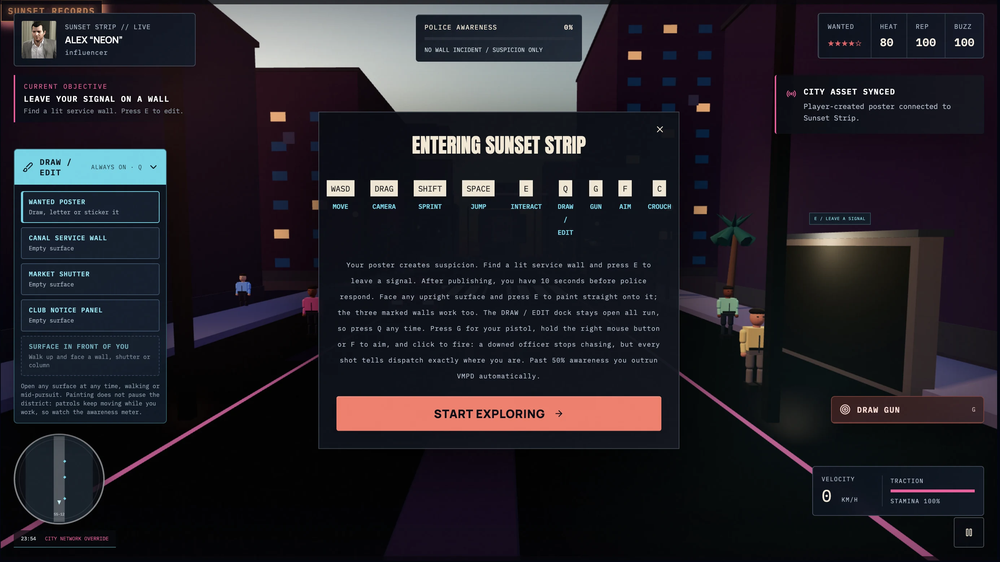
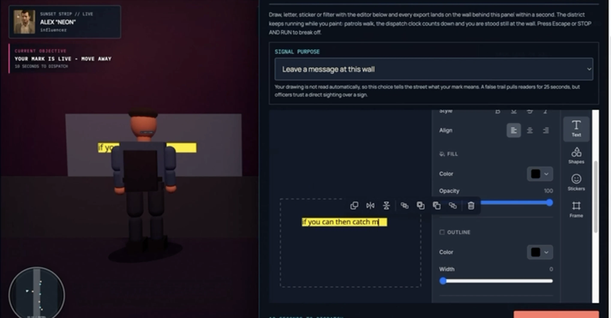
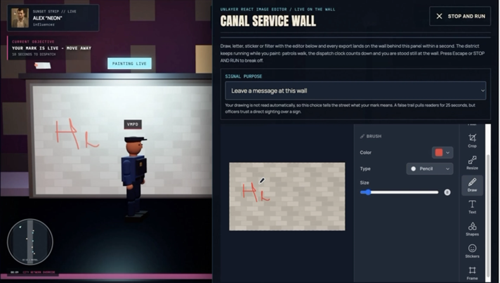
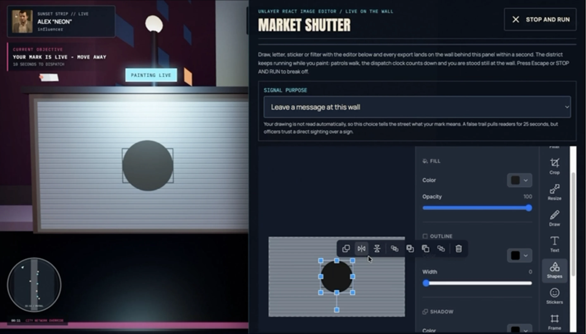
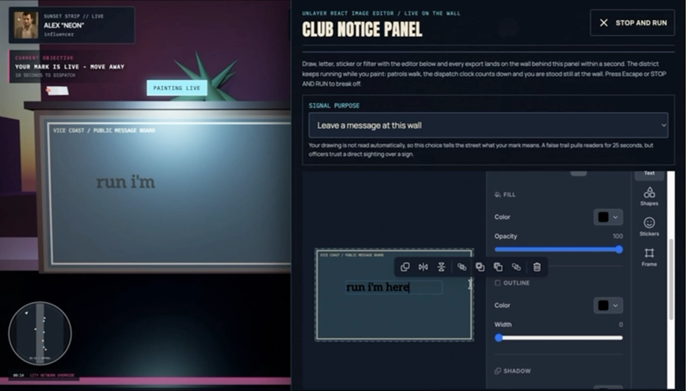
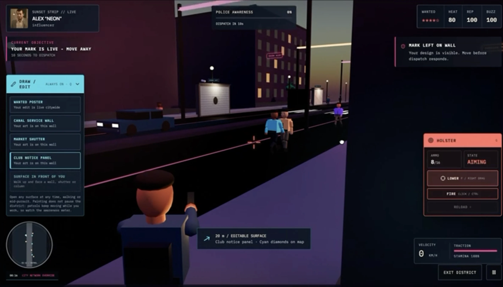
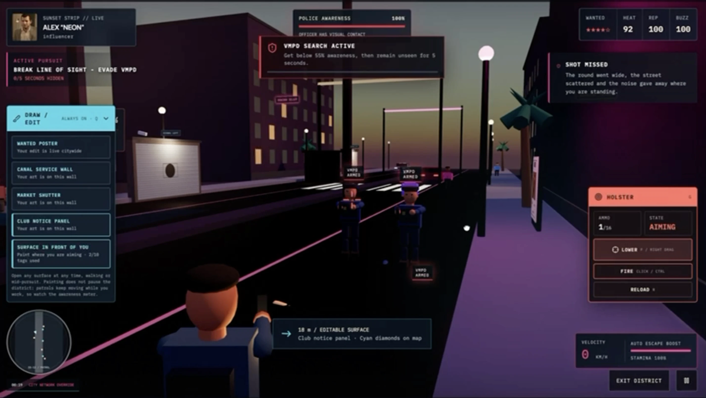
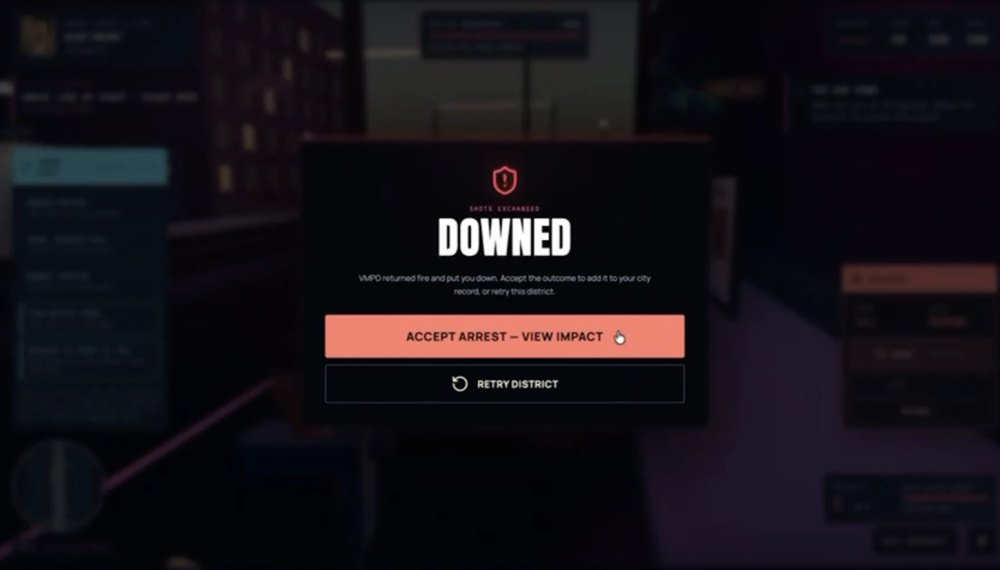

# VICE ID

> Build your identity. Edit your image. Let the city react.

**VICE ID turns image editing into the starting point of a playable identity-and-reputation story.** Create a fictional character, customise their portrait with [Unlayer React Image Editor](https://github.com/unlayer/react-image-editor), turn that portrait into a wanted poster, and publish it across Vice Coast. Explore the city, see simulated public and police reactions, and leave with a downloadable identity card.

Built for Unlayer's [Build with React Image Editor Challenge](https://www.linkedin.com/posts/builtwithimageeditor-ugcPost-7501266289240240128-5qRa/), with an original GTA VI-inspired idea: let players design the identity that appears in the city's wanted notices and then experience the response.

**#BuiltWithImageEditor**

[Launch VICE ID](https://viceid.vercel.app) · [Source code](https://github.com/Anand-240/VICE-ID) · [React Image Editor](https://github.com/unlayer/react-image-editor)

Unlayer React Image Editor is used first to edit the uploaded portrait in **VICE Studio**, then optionally to customise the complete wanted poster in **Wanted Poster Studio**. The saved portrait appears in the dossier and final identity card. The saved poster appears in the city preview, VICEFEED and 3D street displays. These are the player's exported images carried through the experience.

Inside the playable district, the persistent **Draw / Edit** dock brings Unlayer React Image Editor into the street. Paint walls, shutters, notice panels and reachable upright surfaces, or reopen the wanted poster. Wall edits appear in the 3D scene while you work, with patrols still moving. The first visible stroke starts a ten-second dispatch countdown.

[Editor integration](#react-image-editor-is-the-core-creative-tool) · [Try the full journey](#try-the-full-editor-to-world-loop) · [Run locally](#run-locally)

## Product Walkthrough

The first sections show the original identity-to-poster journey. The latest gameplay gallery below shows the always-available editing dock, live surface painting and current pursuit system. Older gameplay screenshots are retained as earlier views of the project. Select any image to open the larger version.

<p align="center">
  <a href="docs/screenshots/01-landing.webp">
    
  </a>
</p>
<p align="center"><sub><b>Enter Vice Coast</b> and begin building the identity the city will remember.</sub></p>

### 1. Create the identity

<table>
  <tr>
    <td width="50%"><a href="docs/screenshots/02-identity-registration.webp"></a></td>
    <td width="50%"><a href="docs/screenshots/03-character-options.webp"></a></td>
  </tr>
  <tr>
    <td align="center"><b>Identity registration</b><br><sub>Enter a name, alias and optional crew while the live preview updates.</sub></td>
    <td align="center"><b>District and lifestyle</b><br><sub>Select one of seven districts and a reputation profile.</sub></td>
  </tr>
</table>

### 2. Edit the portrait with React Image Editor

<p align="center">
  <a href="docs/screenshots/04-react-image-editor.webp">
    
  </a>
</p>
<p align="center"><sub><b>VICE Studio</b> embeds the official React Image Editor with crop, resize, filters, drawing, text, shapes, stickers and frames.</sub></p>

### 3. Turn the edit into a city asset

<table>
  <tr>
    <td width="50%"><a href="docs/screenshots/05-wanted-poster.webp"></a></td>
    <td width="50%"><a href="docs/screenshots/06-city-impact.webp"></a></td>
  </tr>
  <tr>
    <td align="center"><b>Wanted Poster Studio</b><br><sub>Customise, save and publish the generated poster.</sub></td>
    <td align="center"><b>City Impact</b><br><sub>Track sightings, police units, social buzz and district activity.</sub></td>
  </tr>
</table>

### 4. Enter a playable district

<p align="center">
  <a href="docs/screenshots/07-district-entry.webp">
    
  </a>
</p>
<p align="center"><sub><b>District entry</b> introduces movement, camera, sprint, jump and interaction controls before the simulation begins.</sub></p>

#### The poster becomes part of the world

VICE ID places the published wanted poster inside the selected 3D district. The initial layout combines the edited portrait with the character's alias, wanted level, district, profile and reward. Opening **Customize Poster** lets the player edit that whole composition with Unlayer React Image Editor. Any saved text, stickers, drawing, filters or frames become part of the image displayed in the city. Players can also publish the initial composition without this optional second editing session.

<p align="center">
  <a href="docs/screenshots/08-city-gameplay.webp">
    
  </a>
</p>
<p align="center"><sub><b>One editor export, multiple city surfaces.</b> The street panel on the right presents a close physical copy while the distant billboard broadcasts the same wanted poster across Sunset Strip.</sub></p>

| Poster presence | Purpose inside the experience |
| --- | --- |
| **Street panels and poster stands** | Make the edited asset discoverable at pedestrian level and give the player something physical to approach and inspect. |
| **District billboard** | Displays the published poster after 25 seconds of active gameplay, or earlier when local buzz reaches 90. |
| **Nearby witnesses** | Posters create suspicion. Once the player publishes a wall mark, nearby witnesses can report the character's location. |
| **Police response** | The first wall stroke detected by the live editor starts a ten-second delay. Dispatch then investigates and sightings increase awareness. Poster recognition alone does not start pursuit; firing a weapon reports the player's location immediately. |
| **Persistent visual identity** | The same saved poster appears in the city preview, dossier evidence, VICEFEED and poster downloads. The final identity card separately uses the edited portrait and updated story details. |

Recognition is a fictional gameplay simulation based on poster activation, proximity and line of sight. The application does not analyse the uploaded face or perform real facial recognition.

### 5. Face the consequences

<table>
  <tr>
    <td width="50%"><a href="docs/screenshots/09-police-contact.webp"></a></td>
    <td width="50%"><a href="docs/screenshots/10-active-pursuit.webp"></a></td>
  </tr>
  <tr>
    <td align="center"><b>Police awareness</b><br><sub>Visual contact increases awareness according to distance and exposure.</sub></td>
    <td align="center"><b>Active pursuit</b><br><sub>Break line of sight and remain hidden to escape VMPD.</sub></td>
  </tr>
</table>

<p align="center">
  <a href="docs/screenshots/11-apprehended.webp">
    
  </a>
</p>
<p align="center"><sub><b>District outcome</b> records the arrest in the city story or lets the player retry.</sub></p>

### 6. Latest gameplay: from editor canvas to city surface

These screenshots show the current street-editing flow. The important connection is visible in the painting views: the image being edited with **[Unlayer React Image Editor](https://github.com/unlayer/react-image-editor)** on the right becomes artwork on the 3D surface on the left. Unlayer provides the image tools; VICE ID exports the canvas and applies it to the scene.

<table>
  <tr>
    <td width="50%"><a href="docs/screenshots/12-draw-edit-dock.webp"></a></td>
    <td width="50%"><a href="docs/screenshots/13-surface-text.webp"></a></td>
  </tr>
  <tr>
    <td align="center"><b>Editing available from the start</b><br><sub>The Draw / Edit dock lists the wanted poster and prepared painting surfaces beside the district controls.</sub></td>
    <td align="center"><b>Text on a street surface</b><br><sub>Unlayer's Text tool edits a transparent canvas whose exported image is attached to the surface in front of the character.</sub></td>
  </tr>
</table>

<table>
  <tr>
    <td width="50%"><a href="docs/screenshots/14-wall-drawing.webp"></a></td>
    <td width="50%"><a href="docs/screenshots/15-shutter-shapes.webp"></a></td>
  </tr>
  <tr>
    <td align="center"><b>Freehand art on the Canal service wall</b><br><sub>The Unlayer Draw tool creates brush strokes; periodic exports update the wall while the district keeps running.</sub></td>
    <td align="center"><b>Shapes on the Market shutter</b><br><sub>A shape created in Unlayer React Image Editor appears on the shutter texture in the same scene.</sub></td>
  </tr>
</table>

<table>
  <tr>
    <td width="50%"><a href="docs/screenshots/16-notice-panel-text.webp"></a></td>
    <td width="50%"><a href="docs/screenshots/17-mark-live.webp"></a></td>
  </tr>
  <tr>
    <td align="center"><b>Messages on the Club notice panel</b><br><sub>Unlayer's Text tool adds lettering to the panel. Signal Purpose controls the gameplay meaning separately from the written words.</sub></td>
    <td align="center"><b>Your mark is live</b><br><sub>The artwork remains on the street surfaces after closing the editor. The first mark starts the dispatch countdown.</sub></td>
  </tr>
</table>

<table>
  <tr>
    <td width="50%"><a href="docs/screenshots/18-armed-pursuit.webp"></a></td>
    <td width="50%"><a href="docs/screenshots/19-downed.webp"></a></td>
  </tr>
  <tr>
    <td align="center"><b>Pursuit and automatic escape boost</b><br><sub>The editing dock remains available during pursuit. Weapon use reveals your position and can provoke return fire.</sub></td>
    <td align="center"><b>A consequence recorded in the city story</b><br><sub>The Downed screen follows loss of health. Accept the outcome to view its impact or retry the district.</sub></td>
  </tr>
</table>

The drawing tools are not decorative controls. The exported artwork remains visible when the editor closes. The pursuit and outcome screenshots show the surrounding game loop, not features supplied by the image editor itself.

## The idea

VICE ID starts with a question: **what happens after the image is published?**

Here, your edit becomes an asset inside the experience. Your portrait appears in a police dossier; your customised wanted poster appears on city displays; your character choices and gameplay contribute to a fictional reputation. The final VICE ID brings your edited identity and the city's response together.

The visual direction combines a neon coastal city, police-record interfaces, terminal-style inputs, and original illustrated district and lifestyle cards. It draws inspiration from GTA-style urban storytelling, but uses fictional places and procedural game characters rather than GTA character models.

## React Image Editor is the core creative tool

VICE ID embeds the official [Unlayer React Image Editor](https://github.com/unlayer/react-image-editor) through **`@unlayer/react-image-editor`** across the following connected editing workflows:

| Editor session | Starting image | What the player does | Where the result goes |
| --- | --- | --- | --- |
| **VICE Studio** | Uploaded portrait | Crop, resize, filter, draw, add text, shapes, stickers or frames | Dossier, wanted-poster composition and final identity card |
| **Wanted Poster Studio** | Generated wanted poster containing the edited portrait | Optionally customise the complete poster before publishing | Poster preview, dossier evidence, VICEFEED, 3D city displays and poster download |
| **Street Signal Studio** | Brick wall, shutter, notice panel or an existing mark | Draw, write, add shapes or stickers while the district keeps running | Live texture updates on the selected surface, plus a configurable street signal |
| **Free-surface painting** | Transparent canvas attached to a reachable upright surface | Use the same Unlayer tools to create a mark where the player is facing | A surface-aligned image patch in the 3D world |
| **In-game poster editing** | The current wanted poster | Reopen the editor from Draw / Edit, change the composition and publish | All poster stands and the active billboard in the current district run |

### How the integration works

The shared [ViceImageEditor component](src/components/editor/ViceImageEditor.tsx) wraps the official editor and connects it to the rest of the application.

- **Native tools:** crop, resize, filters, drawing, text, shapes, stickers and frames are enabled inside the editor.
- **Image exports:** the editor's `onSave({ dataUrl })` callback saves the result. **Lock Identity** and **Save & Preview** use the editor instance's `getImage()` method to capture the current canvas. **Publish to City** exports the canvas when the poster editor is open, or uses the saved poster when in preview mode.
- **Live painting:** Street Signal Studio checks the editor's `hasChanges()` and polls a safe `getImage()` export through `peekImage()` every 850 ms. Changed exports update the selected wall texture or surface image. This is periodic image export, not native 3D painting inside Unlayer.
- **In-game poster updates:** **Publish Poster** exports the canvas into district-local `livePoster` state. It replaces the current run's poster displays without overwriting the creator's saved poster.
- **Shared state:** the exported portrait is stored as `editedImage`; the exported poster is stored as `wantedPosterImage`. Subsequent screens consume those images.
- **Session continuity:** the source image stays fixed while an editing session is mounted, so saving does not reload the canvas and discard that session's editing history.
- **Recovery:** loading states, error messages, a loading timeout and retry support help recover from editor failures. Export-dependent actions wait until the editor is ready.
- **Responsive access:** on narrow screens, the native editor sits in a horizontally scrollable workspace so its tools remain reachable.

The image pipeline is:

```text
Uploaded portrait
  → React Image Editor: portrait editing
  → Saved edited portrait
      → Police dossier
      → Final VICE ID composition
      → Wanted-poster composition
          → Optional React Image Editor: poster customisation
          → Saved poster
              → City preview and 3D poster surfaces
              → Wanted-poster download
              → In-game React Image Editor: poster remix for this run

Wall texture or transparent surface canvas
  → React Image Editor: drawing, text, shapes, stickers and other tools
  → Periodic image exports
  → Live 3D surface texture
  → Publish Signal: apply the selected message or false-trail behavior
```

**What the app adds around the editor:** VICE ID uses the browser Canvas API to compose the initial wanted-poster layout and final identity card. React Image Editor handles the player's image-editing work. The city simulation and 3D gameplay then place the saved poster on street panels, poster stands and the district billboard so the editor output becomes part of play.

Saved images are flattened exports. Editable layers and undo history are not persisted across separate editor sessions. The project does not use image analysis to calculate reputation or identify faces.

## The complete experience

### 1. Register your identity

Enter a name, alias and optional crew through terminal-styled form fields. Upload a JPG, PNG or WebP portrait, choose a district and lifestyle, and set a one-to-five-star wanted level.

The creator shows a live preview with heat, reputation and style scores. These scores come from the selected district, lifestyle and wanted level. Upload validation checks file type, size and image decoding, with limits of 15 MB and 40 megapixels.

The terminal presentation still uses normal text inputs, including keyboard editing and paste. On desktop, the preview stays visible while you browse the choices.

### 2. Build your look in VICE Studio

Open the portrait in React Image Editor and make it your own. Select **Lock Identity** to export the current canvas and carry that edited portrait into the story.

### 3. Review the VMPD dossier

Your character becomes a fictional police intelligence record with an edited portrait, case ID, bounty, wanted status and reputation details.

Explore **Overview**, **Activity**, **Known Locations** and **Evidence**. The dossier connects the identity, district, poster and later city updates rather than displaying an unrelated profile.

### 4. Create and customise your wanted poster

**Issue Wanted Poster** generates a 1080 × 1350 composition from your edited portrait and character details.

Choose **Customize Poster** to open the second React Image Editor session. Add your own text, marks, stickers, filters or other edits, then preview, download or publish the actual result. Resizing in the editor can change the poster's dimensions.

When the player publishes from the editor, VICE ID stores the current canvas export as `wantedPosterImage`. Publishing from preview uses the saved poster. Poster stands, street displays, the large district billboard, evidence views and downloads all read from that image, keeping the creative result consistent from editing to gameplay.

Poster edits change the displayed visual. Drawing different stars or a reward on the poster does not change the character's wanted level or bounty; those values come from character settings and game events.

### 5. Publish to City Impact

Publishing initialises a local city simulation: poster reach, sightings, buzz, police attention and a chronological event feed.

Select districts on the city map, inspect their response, or simulate the next hour. From here, enter a playable district or continue directly to the social feed.

### 6. Enter a playable district

Explore a third-person, stylised 3D environment with pedestrians, patrol officers, a minimap, objectives and your customised poster on in-world displays.

The seven districts have distinct environment configurations, landmarks, palettes and layouts:

| District | Identity |
| --- | --- |
| **Ocean Heights** | Luxury coastal towers and beach-club surroundings |
| **Neon Harbor** | Cargo docks, industrial structures and neon nightlife |
| **Sunset Strip** | Entertainment streets, clubs and illuminated signs |
| **Coral Bay** | Marina scenery, waterfront leisure and yacht-club atmosphere |
| **Little Palma** | Local shops, market details and neighbourhood street culture |
| **Downtown Vice** | Corporate towers and dense urban surroundings |
| **South Point** | Warehouses, garages and industrial racing atmosphere |

Movement uses Rapier physics for gravity and collisions, with acceleration, braking, grounded jumping, limited air control and stamina-based sprinting. The camera follows movement and checks for obstructions.

#### Draw and edit throughout the run

The **Draw / Edit** dock is visible from the start. Choose the wanted poster, Canal service wall, Market shutter or Club notice panel. **Q** reopens the last selected editing target. Editing remains available during pursuit.

For a new street mark, face a reachable upright surface and press **E**, or choose **Surface in front of you**. The game checks surface orientation and reach before attaching a transparent painting canvas. Floors and ceilings are excluded. Up to ten free-surface marks are retained; adding another removes the oldest displayed patch.

**Unlayer React Image Editor supplies the actual Draw, Text, Shapes, Stickers, Crop, Resize, Filters and Frame tools.** Wall painting opens beside the 3D scene. Changed canvas exports appear on the selected surface roughly every 850 ms. The character stays at the painting location while pedestrians and patrols continue moving.

The first detected stroke starts **10 seconds of active game time** before dispatch investigates. Closing the studio does not erase paint already applied. Use **Stop and Run** or **Escape** to leave the wall. Additional strokes and later marks do not restart the initial countdown.

Choose a signal purpose, then **Publish Signal** to commit a normal message or a north/south false trail. Nearby readers with a clear view can follow a false trail for up to 25 seconds. Police prioritize direct sightings and fresh witness reports. The game uses the selected purpose, not an interpretation of the words or symbols you draw.

**Poster editing works differently:** it pauses the district. **Publish Poster** replaces the current run's poster stands and active billboard with the exported composition. Changing the picture does not reset awareness or change the underlying wanted level.

#### Movement, pursuit and outcomes

Movement uses collision-aware acceleration and braking, jumping, crouching and a shoulder camera. At **50% awareness or during pursuit**, an automatic escape boost raises normal running speed to **8.5 game units per second**, above the pursuing officers' **6.1**. No Shift key is needed for the boost, and it does not consume sprint stamina. Aiming and crouching still reduce movement speed.

Poster sightings create suspicion. Wall painting creates a reportable incident. At **100% awareness**, pursuit begins automatically. Break line of sight, reduce awareness below 55%, and remain unseen for five seconds to escape. Close officer contact can cause an arrest.

The district also includes optional fictional combat: draw or holster a pistol, aim, fire and reload. Shots reveal the player's location immediately and increase awareness, bypassing the wall-painting grace period. A hit officer temporarily stops pursuing; firing triggers an armed response after five seconds. Return fire can reduce health to zero and produce the **Downed** outcome. The district summary records shots fired, officers down and bystanders hit alongside recognition and police reports.

Wall painting does **not** pause the simulation or the dispatch countdown. The pause menu and poster editor do. Wall art, free-surface marks and in-game poster remixes last for the current district run and clear when it restarts or ends. Accepted district outcomes feed back into the city story.

Select **Start Exploring** after loading to begin. Poster displays activate progressively during active gameplay; billboard publication is not tied to reaching 100% police awareness.

### 7. See the response in VICEFEED

A fictional social feed reflects the character, publication and recorded city outcomes. Browse reactions, toggle likes, and use the available share and download actions.

This is a local narrative simulation, not a live social network.

### 8. Claim your VICE ID

Generate a 1080 × 1350 final identity card containing your edited portrait and story details. Download the card, view or download your customised wanted poster, share where the browser supports it, or restart with a new identity.

## Try the full editor-to-world loop

1. Open [VICE ID](https://viceid.vercel.app) and enter the creator.
2. Upload a portrait, enter a name and alias, and select your character options.
3. Choose **Build My Look**, make a visible edit, then **Lock Identity**.
4. Open the dossier and select **Issue Wanted Poster**.
5. Choose **Customize Poster** and add something recognisable, such as a text label or sticker.
6. **Save & Preview**, then **Publish to City**.
7. Enter a district, select **Start Exploring**, and find your published poster.
8. Open **Draw / Edit** and try a marked wall. Use Draw, Text or Shapes and watch the exported image appear in the scene. The first stroke starts the ten-second countdown; use **Stop and Run** to move away.
9. Try a reachable upright surface with **E**, or choose **Wanted Poster** to remix the current district's poster. Use **Publish Signal** for a chosen false trail or **Publish Poster** for the poster network.
10. Complete or leave the district, continue through VICEFEED, and download your final VICE ID and poster.

This path demonstrates the portrait, poster and in-world editor workflows and how their exports connect to the rest of the project. No application account or login is required.

## Gameplay controls

| Action | Desktop |
| --- | --- |
| Move | WASD or arrow keys |
| Rotate camera | Drag inside the game |
| Sprint | Hold Shift; uses stamina |
| Jump | Space |
| Paint a reachable surface or inspect a nearby poster | E; painting takes priority |
| Reopen the last editing target | Q or the Draw / Edit dock |
| Stop live wall painting | Escape or Stop and Run |
| Automatic escape boost | Active at 50% awareness or during pursuit; move normally |
| Crouch | Hold C |
| Draw / holster pistol | G |
| Aim | Hold right mouse button, or toggle with F |
| Fire while aiming | Left click or Control |
| Reload | R |
| Pause / resume | Escape or the on-screen control |

Touch controls provide movement, run, jump, crouch, interaction, aim and fire buttons on supported mobile layouts. The Draw / Edit dock gives access to the same editing targets. The interface also provides district exit and pursuit-result actions.

## Technology and project structure

| Technology | Role |
| --- | --- |
| React 18 + TypeScript | Interface, screen flow and typed application state |
| Vite | Development server and production build |
| Unlayer React Image Editor | Portrait, wanted-poster and in-world wall editing |
| Zustand | Shared character, publication and gameplay state |
| IndexedDB | Browser-local persistence, including exported images |
| Canvas API | Wanted-poster and final-card composition |
| Three.js + React Three Fiber + Drei | Playable 3D districts and scene rendering |
| React Three Rapier | Game physics |
| Framer Motion | Interface transitions |
| Lucide | Interface icons |

Key implementation files:

```text
src/
├── App.tsx                         Main journey and screen integration
├── components/
│   ├── editor/ViceImageEditor.tsx   Official editor wrapper and export bridge
│   ├── IdentityTerminal.tsx        Terminal-styled identity inputs
│   ├── TerminalSequence.tsx        Typed transition presentation
│   ├── DistrictArtwork.tsx         Original district illustrations
│   └── LifestyleArtwork.tsx        Original lifestyle illustrations
├── game/
│   ├── ViceDistrictGame.tsx        Gameplay flow, awareness and outcomes
│   ├── NeonHarborScene.tsx         Shared district scene, characters and physics
│   ├── DistrictMinimap.tsx         In-game minimap
│   ├── police.ts                  Detection, awareness and patrol navigation
│   ├── walls.ts                   Editable wall locations, signals and response delay
│   ├── tags.ts                    Reachable surfaces and painting patches
│   ├── movement.ts                Walking, sprinting and automatic escape speed
│   ├── locomotion.ts              Movement and animation helpers
│   ├── weapon.ts                  Fictional combat, ammo, damage and recovery
│   └── districts.ts               Seven district configurations
├── lib/
│   ├── image.ts                   Poster and final-card composition
│   ├── city.ts                    City simulation
│   ├── scoring.ts                 Scores, bounty and character-derived text
│   └── storage.ts                 IndexedDB storage and memory fallback
├── store/characterStore.ts         Shared state and persistence
├── styles.css                     Base interface styles
├── visual-polish.css              Visual refinements and responsive layouts
└── terminal.css                   Identity console styling
tests/
├── city.test.mjs                   Simulation and configuration regression tests
├── police.test.mjs                 Detection, contact and navigation tests
├── walls.test.mjs                  Wall interaction and response gating tests
├── movement.test.mjs               Speed and escape boost tests
├── locomotion.test.mjs             Movement regression tests
├── tags.test.mjs                   Painting surface and patch limits
└── weapon.test.mjs                 Ammo, firing, damage and recovery tests
```

Despite its filename, `NeonHarborScene.tsx` renders the shared scene system for all seven district configurations.

## Run locally

Use **Node.js 22.6 or newer** and npm. An internet connection is needed for the external editor runtime and assets; the optional 3D experience requires WebGL.

```bash
git clone https://github.com/Anand-240/VICE-ID.git
cd VICE-ID
npm ci
npm run dev
```

Open the local URL printed by Vite.

| Command | Purpose |
| --- | --- |
| `npm run dev` | Start the development server |
| `npm run build` | Run TypeScript checks and build into `dist/` |
| `npm run preview` | Preview the production build locally |
| `npm test` | Run simulation, police, movement, painting and combat logic tests |

The automated tests cover city publication, simulated time rollover, district configurations, score bounds, bounty progression, police detection, awareness rates, arrest conditions, navigation around obstacles, movement, escape boost, paintable surfaces, patch limits and weapon-state logic. Browser testing is still needed for the external editor, downloads, touch controls and rendered 3D gameplay.

### Deploy to Vercel

Use the **Vite** preset, the repository root as the root directory, `npm run build` as the build command and `dist` as the output directory. No project-specific environment variables are required for the current implementation.

After deploying, test the complete upload → edit → poster → publish → gameplay → download journey on the public URL, including the external editor loading successfully.

## Persistence, recovery and scope

- **Local progress:** character details, exported images, city state and completed district outcomes are saved in IndexedDB in the same browser and origin. They are not synced between devices.
- **Storage fallback:** if persistent storage is unavailable, the app uses memory storage; progress may be lost when the page closes.
- **Run-local artwork:** wall textures, free-surface marks and in-game poster remixes are not saved across district restarts. The original creator exports remain in character storage.
- **Gameplay reloads:** refreshing during a district returns to City Impact instead of restoring an in-progress physics simulation.
- **Failure handling:** upload validation, editor retry, prerequisite checks, generation errors and a 3D scene fallback provide recovery paths.
- **Responsive interface:** adaptive grids, a desktop sticky preview, labelled inputs, keyboard focus styles, reduced-motion support and mobile game controls support different ways of using the app.
- **External dependencies:** the app has no custom backend, but the editor runtime and fonts depend on external services. Browser-local persistence does not make the complete experience offline.
- **Simulated world:** police records, recognition, engagement figures and city events are fictional. Reputation is calculated from choices and events, not analysis of the uploaded image.
- **Game scope:** this is a browser-based creative experience with a lightweight playable city, not a full open-world GTA game. The uploaded portrait does not generate a 3D avatar.
- **Browser differences:** WebGL performance, native sharing and clipboard availability depend on the device, browser and permissions.

## How this fits the challenge

VICE ID is an original GTA VI-inspired identity and street-art experience built around user-created visuals.

| Challenge requirement | Implementation in VICE ID |
| --- | --- |
| Original GTA-inspired experience | A fictional coastal city where the player's edited identity, posters and street marks become part of play |
| React Image Editor as a core component | The official Unlayer component powers portrait editing, poster customization, in-game poster remixes and surface painting |
| Let users customize at least one visual | Users can edit both personal images and multiple city surfaces using the native editor tools |
| Public source and clear documentation | [VICE-ID on GitHub](https://github.com/Anand-240/VICE-ID), with setup steps and integration details in this README |
| Deployed experience | [Live website](https://viceid.vercel.app) |
| Demonstrate the experience | The screenshot galleries above |

The editor supplies the creative tools. VICE ID connects their image exports to the dossier, poster network, playable environment and final identity card. This README describes the implementation; it does not claim that the submission form or social-sharing steps have been completed.

## Credits

- Image editing: [Unlayer React Image Editor](https://github.com/unlayer/react-image-editor)
- 3D rendering and physics: Three.js, React Three Fiber, Drei and Rapier
- Interface icons: [Lucide](https://lucide.dev/)
- Typography: Anton, Manrope and IBM Plex Mono
- Visual assets: coastal background artwork, original SVG district and lifestyle illustrations, procedural 3D scenes, and portraits supplied by the user

VICE ID is an independent, GTA-inspired project and is not affiliated with Rockstar Games.

**Built with React Image Editor. Built around what happens after you edit.**
