# VICE ID

> Build your identity. Edit your image. Let the city react.

**VICE ID turns image editing into the starting point of a playable identity-and-reputation story.** Create a fictional character, customise their portrait with [Unlayer React Image Editor](https://github.com/unlayer/react-image-editor), turn that portrait into a wanted poster, and publish it across Vice Coast. Explore the city, see simulated public and police reactions, and leave with a downloadable identity card.

Built for Unlayer's [Build with React Image Editor Challenge](https://www.linkedin.com/posts/builtwithimageeditor-ugcPost-7501266289240240128-5qRa/), with an original GTA VI-inspired idea: let players design the identity that appears in the city's wanted notices and then experience the response.

**#BuiltWithImageEditor**

[Launch VICE ID](https://viceid.vercel.app) · [Source code](https://github.com/Anand-240/VICE-ID) · [React Image Editor](https://github.com/unlayer/react-image-editor)

Unlayer React Image Editor is used first to edit the uploaded portrait in **VICE Studio**, then optionally to customise the complete wanted poster in **Wanted Poster Studio**. The saved portrait appears in the dossier and final identity card. The saved poster appears in the city preview, VICEFEED and 3D street displays. These are the player's exported images carried through the experience.

Inside the playable district, **Street Signal Studio** opens the same editor on a wall surface. Publish your drawing or message onto the wall, then move before the ten-second police response delay ends.

[Editor integration](#react-image-editor-is-the-core-creative-tool) · [Try the full journey](#try-the-full-editor-to-world-loop) · [Run locally](#run-locally)

## Demo Video

Watch the project demo, covering character creation, the Unlayer React Image Editor workspace, wanted poster publishing, city reactions and police pursuit gameplay.

[](https://youtu.be/e4qh5EbIwJo)

[Watch the full VICE ID demo on YouTube](https://youtu.be/e4qh5EbIwJo)

## Product Walkthrough

The screenshots below show the identity, editing and pursuit journey. They were captured before the street wall editing and character movement update. Select any image to open the larger version.

<p align="center">
  <a href="docs/screenshots/01-landing.webp">
    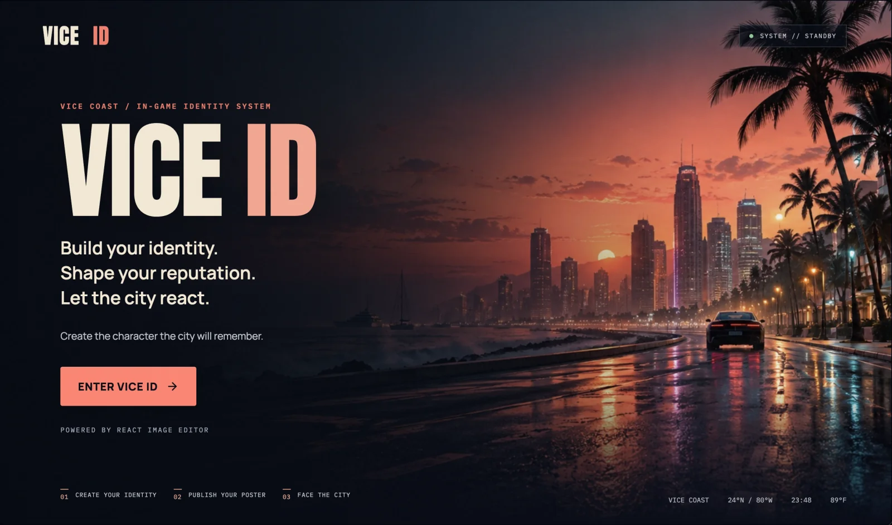
  </a>
</p>
<p align="center"><sub><b>Enter Vice Coast</b> and begin building the identity the city will remember.</sub></p>

### 1. Create the identity

<table>
  <tr>
    <td width="50%"><a href="docs/screenshots/02-identity-registration.webp">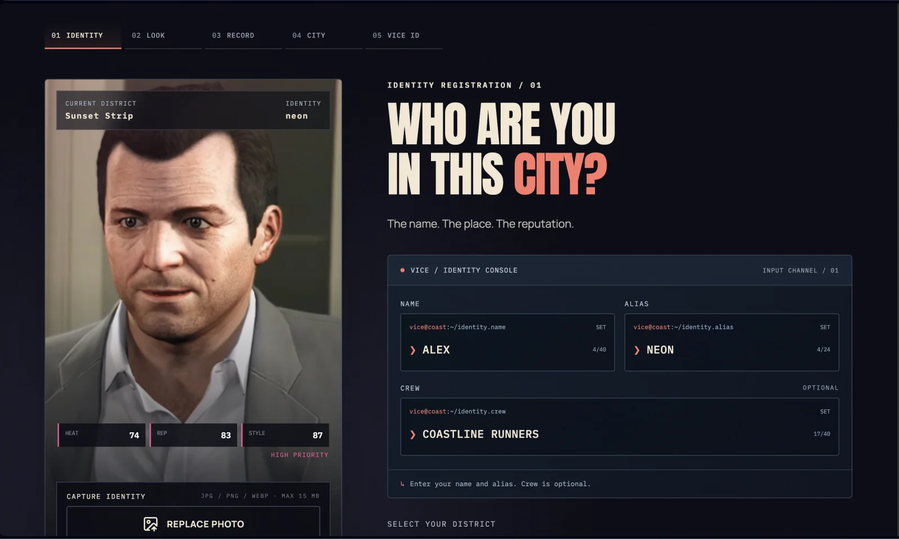</a></td>
    <td width="50%"><a href="docs/screenshots/03-character-options.webp">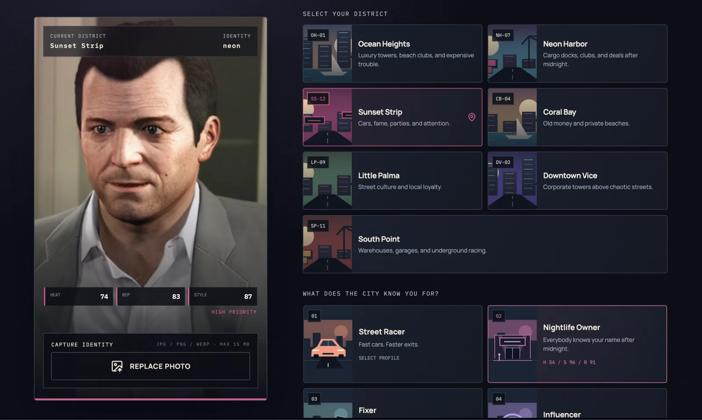</a></td>
  </tr>
  <tr>
    <td align="center"><b>Identity registration</b><br><sub>Enter a name, alias and optional crew while the live preview updates.</sub></td>
    <td align="center"><b>District and lifestyle</b><br><sub>Select one of seven districts and a reputation profile.</sub></td>
  </tr>
</table>

### 2. Edit the portrait with React Image Editor

<p align="center">
  <a href="docs/screenshots/04-react-image-editor.webp">
    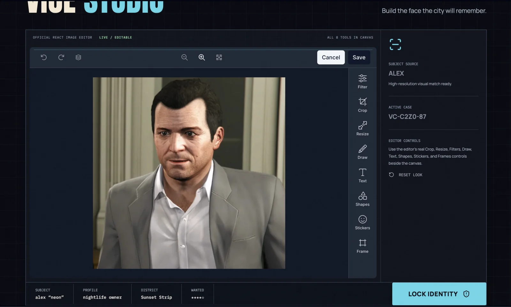
  </a>
</p>
<p align="center"><sub><b>VICE Studio</b> embeds the official React Image Editor with crop, resize, filters, drawing, text, shapes, stickers and frames.</sub></p>

### 3. Turn the edit into a city asset

<table>
  <tr>
    <td width="50%"><a href="docs/screenshots/05-wanted-poster.webp">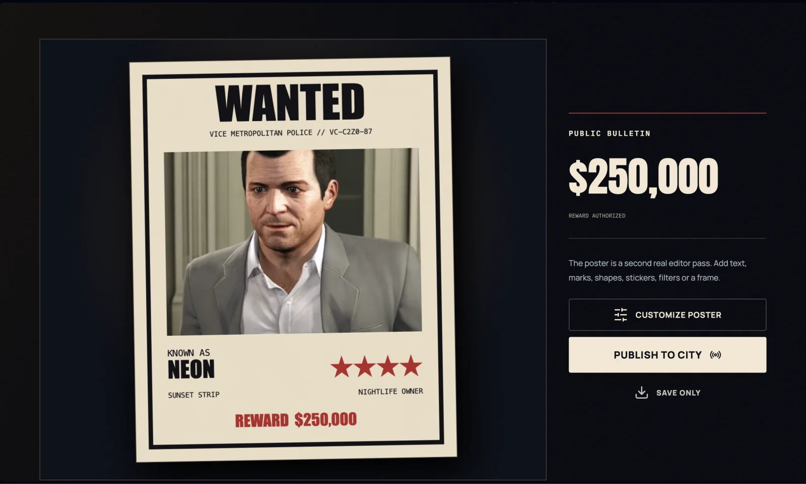</a></td>
    <td width="50%"><a href="docs/screenshots/06-city-impact.webp">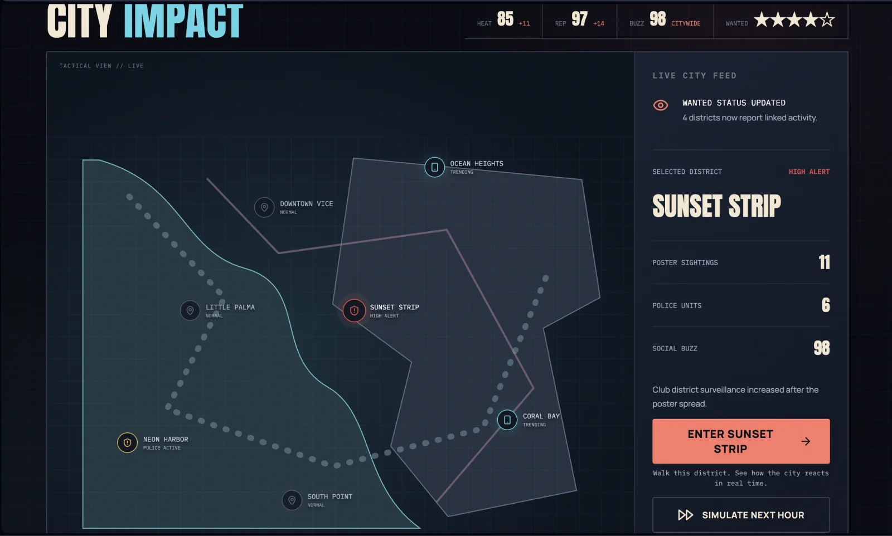</a></td>
  </tr>
  <tr>
    <td align="center"><b>Wanted Poster Studio</b><br><sub>Customise, save and publish the generated poster.</sub></td>
    <td align="center"><b>City Impact</b><br><sub>Track sightings, police units, social buzz and district activity.</sub></td>
  </tr>
</table>

### 4. Enter a playable district

<p align="center">
  <a href="docs/screenshots/07-district-entry.webp">
    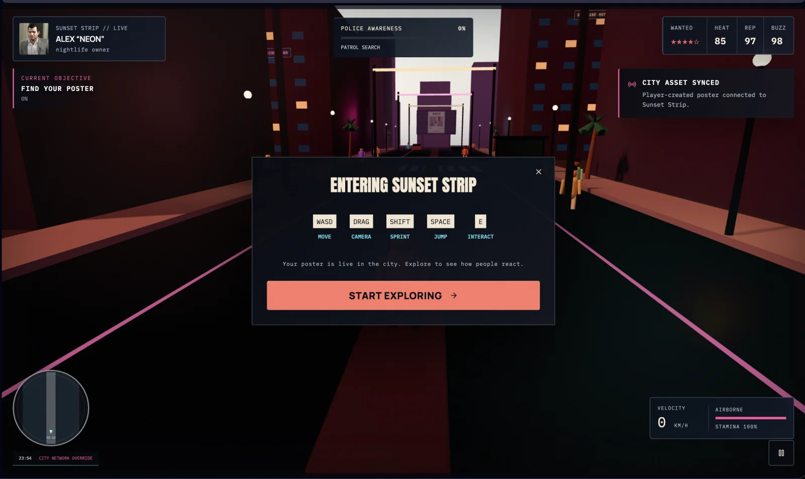
  </a>
</p>
<p align="center"><sub><b>District entry</b> introduces movement, camera, sprint, jump and interaction controls before the simulation begins.</sub></p>

#### The poster becomes part of the world

VICE ID places the published wanted poster inside the selected 3D district. The initial layout combines the edited portrait with the character's alias, wanted level, district, profile and reward. Opening **Customize Poster** lets the player edit that whole composition with Unlayer React Image Editor. Any saved text, stickers, drawing, filters or frames become part of the image displayed in the city. Players can also publish the initial composition without this optional second editing session.

<p align="center">
  <a href="docs/screenshots/08-city-gameplay.webp">
    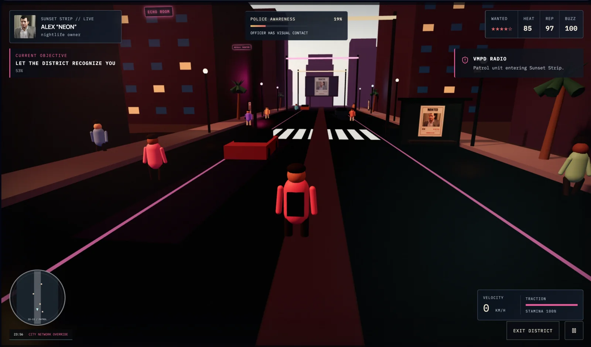
  </a>
</p>
<p align="center"><sub><b>One editor export, multiple city surfaces.</b> The street panel on the right presents a close physical copy while the distant billboard broadcasts the same wanted poster across Sunset Strip.</sub></p>

| Poster presence | Purpose inside the experience |
| --- | --- |
| **Street panels and poster stands** | Make the edited asset discoverable at pedestrian level and give the player something physical to approach and inspect. |
| **District billboard** | Displays the published poster after 25 seconds of active gameplay, or earlier when local buzz reaches 90. |
| **Nearby witnesses** | Posters create suspicion. Once the player publishes a wall mark, nearby witnesses can report the character's location. |
| **Police response** | The first wall publication starts a ten-second delay. After that, dispatch investigates the incident and officer sightings increase awareness. Poster recognition alone does not start a pursuit. |
| **Persistent visual identity** | The same saved poster appears in the city preview, dossier evidence, VICEFEED and poster downloads. The final identity card separately uses the edited portrait and updated story details. |

Recognition is a fictional gameplay simulation based on poster activation, proximity and line of sight. The application does not analyse the uploaded face or perform real facial recognition.

### 5. Face the consequences

<table>
  <tr>
    <td width="50%"><a href="docs/screenshots/09-police-contact.webp">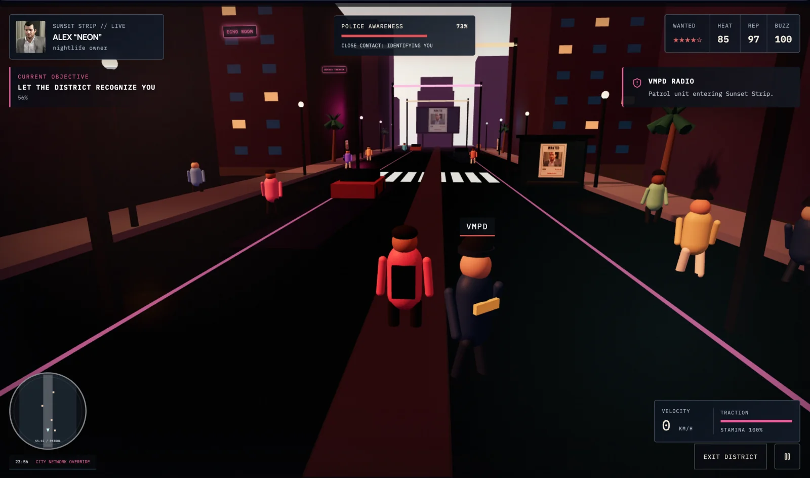</a></td>
    <td width="50%"><a href="docs/screenshots/10-active-pursuit.webp">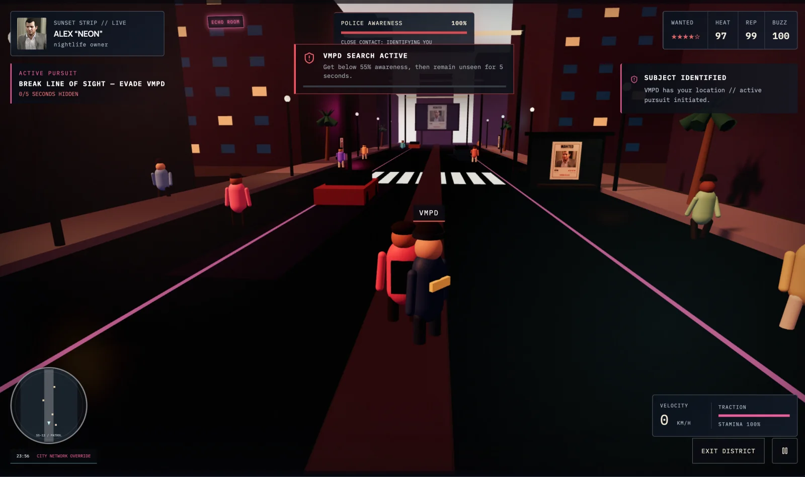</a></td>
  </tr>
  <tr>
    <td align="center"><b>Police awareness</b><br><sub>Visual contact increases awareness according to distance and exposure.</sub></td>
    <td align="center"><b>Active pursuit</b><br><sub>Break line of sight and remain hidden to escape VMPD.</sub></td>
  </tr>
</table>

<p align="center">
  <a href="docs/screenshots/11-apprehended.webp">
    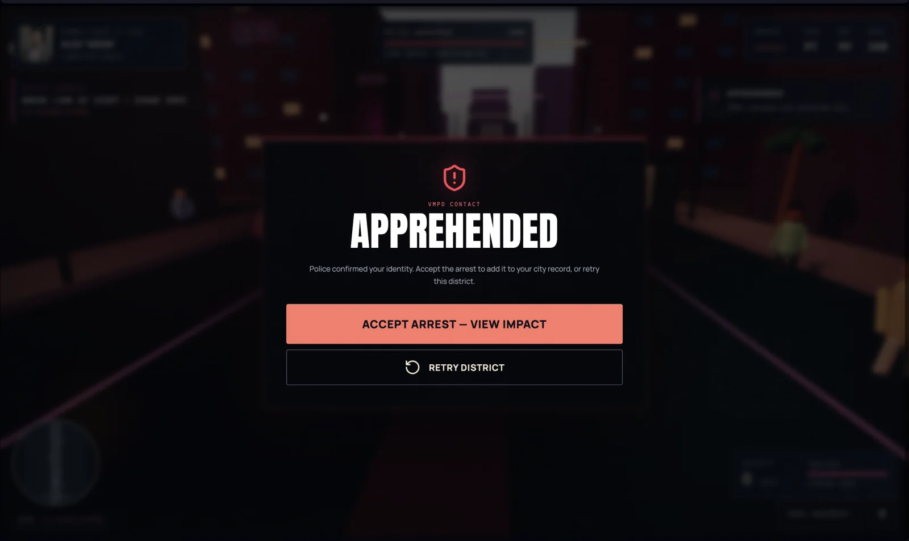
  </a>
</p>
<p align="center"><sub><b>District outcome</b> records the arrest in the city story or lets the player retry.</sub></p>

## The idea

VICE ID starts with a question: **what happens after the image is published?**

Here, your edit becomes an asset inside the experience. Your portrait appears in a police dossier; your customised wanted poster appears on city displays; your character choices and gameplay contribute to a fictional reputation. The final VICE ID brings your edited identity and the city's response together.

The visual direction combines a neon coastal city, police-record interfaces, terminal-style inputs, and original illustrated district and lifestyle cards. It draws inspiration from GTA-style urban storytelling, but uses fictional places and procedural game characters rather than GTA character models.

## React Image Editor is the core creative tool

VICE ID embeds the official [Unlayer React Image Editor](https://github.com/unlayer/react-image-editor) through **`@unlayer/react-image-editor`** in three connected workspaces:

| Editor session | Starting image | What the player does | Where the result goes |
| --- | --- | --- | --- |
| **VICE Studio** | Uploaded portrait | Crop, resize, filter, draw, add text, shapes, stickers or frames | Dossier, wanted-poster composition and final identity card |
| **Wanted Poster Studio** | Generated wanted poster containing the edited portrait | Optionally customise the complete poster before publishing | Poster preview, dossier evidence, VICEFEED, 3D city displays and poster download |
| **Street Signal Studio** | Brick wall surface, or its existing saved mark | Draw, write or place a visual signal while the game is paused | The selected 3D wall, with a delayed police response after the first publication |

### How the integration works

The shared [ViceImageEditor component](src/components/editor/ViceImageEditor.tsx) wraps the official editor and connects it to the rest of the application.

- **Native tools:** crop, resize, filters, drawing, text, shapes, stickers and frames are enabled inside the editor.
- **Image exports:** the editor's `onSave({ dataUrl })` callback saves the result. **Lock Identity** and **Save & Preview** use the editor instance's `getImage()` method to capture the current canvas. **Publish to City** exports the canvas when the poster editor is open, or uses the saved poster when in preview mode.
- **Shared state:** the exported portrait is stored as `editedImage`; the exported poster is stored as `wantedPosterImage`. Subsequent screens consume those images.
- **Session continuity:** the source image stays fixed while an editing session is mounted, so saving does not reload the canvas and discard that session's editing history.
- **Recovery:** loading states, error messages, a loading timeout and retry support help recover from editor failures. Export-dependent actions wait until the editor is ready.
- **Responsive access:** on narrow screens, the native editor sits in a horizontally scrollable workspace so its tools remain reachable.

The image pipeline is:

```text
Uploaded portrait
  → React Image Editor: portrait editing
  → Saved edited portrait
      → Police dossier
      → Final VICE ID composition
      → Wanted-poster composition
          → Optional React Image Editor: poster customisation
          → Saved poster
              → City preview and 3D poster surfaces
              → Wanted-poster download
```

**What the app adds around the editor:** VICE ID uses the browser Canvas API to compose the initial wanted-poster layout and final identity card. React Image Editor handles the player's image-editing work. The city simulation and 3D gameplay then place the saved poster on street panels, poster stands and the district billboard so the editor output becomes part of play.

Saved images are flattened exports. Editable layers and undo history are not persisted across separate editor sessions. The project does not use image analysis to calculate reputation or identify faces.

## The complete experience

### 1. Register your identity

Enter a name, alias and optional crew through terminal-styled form fields. Upload a JPG, PNG or WebP portrait, choose a district and lifestyle, and set a one-to-five-star wanted level.

The creator shows a live preview with heat, reputation and style scores. These scores come from the selected district, lifestyle and wanted level. Upload validation checks file type, size and image decoding, with limits of 15 MB and 40 megapixels.

The terminal presentation still uses normal text inputs, including keyboard editing and paste. On desktop, the preview stays visible while you browse the choices.

### 2. Build your look in VICE Studio

Open the portrait in React Image Editor and make it your own. Select **Lock Identity** to export the current canvas and carry that edited portrait into the story.

### 3. Review the VMPD dossier

Your character becomes a fictional police intelligence record with an edited portrait, case ID, bounty, wanted status and reputation details.

Explore **Overview**, **Activity**, **Known Locations** and **Evidence**. The dossier connects the identity, district, poster and later city updates rather than displaying an unrelated profile.

### 4. Create and customise your wanted poster

**Issue Wanted Poster** generates a 1080 × 1350 composition from your edited portrait and character details.

Choose **Customize Poster** to open the second React Image Editor session. Add your own text, marks, stickers, filters or other edits, then preview, download or publish the actual result. Resizing in the editor can change the poster's dimensions.

When the player publishes from the editor, VICE ID stores the current canvas export as `wantedPosterImage`. Publishing from preview uses the saved poster. Poster stands, street displays, the large district billboard, evidence views and downloads all read from that image, keeping the creative result consistent from editing to gameplay.

Poster edits change the displayed visual. Drawing different stars or a reward on the poster does not change the character's wanted level or bounty; those values come from character settings and game events.

### 5. Publish to City Impact

Publishing initialises a local city simulation: poster reach, sightings, buzz, police attention and a chronological event feed.

Select districts on the city map, inspect their response, or simulate the next hour. From here, enter a playable district or continue directly to the social feed.

### 6. Enter a playable district

Explore a third-person, stylised 3D environment with pedestrians, patrol officers, a minimap, objectives and your customised poster on in-world displays.

The seven districts have distinct environment configurations, landmarks, palettes and layouts:

| District | Identity |
| --- | --- |
| **Ocean Heights** | Luxury coastal towers and beach-club surroundings |
| **Neon Harbor** | Cargo docks, industrial structures and neon nightlife |
| **Sunset Strip** | Entertainment streets, clubs and illuminated signs |
| **Coral Bay** | Marina scenery, waterfront leisure and yacht-club atmosphere |
| **Little Palma** | Local shops, market details and neighbourhood street culture |
| **Downtown Vice** | Corporate towers and dense urban surroundings |
| **South Point** | Warehouses, garages and industrial racing atmosphere |

Movement uses Rapier physics for gravity and collisions, with acceleration, braking, grounded jumping, limited air control and stamina-based sprinting. The camera follows movement and checks for obstructions.

Posters create suspicion without starting a pursuit. Approach a service wall marked by a cyan diamond on the minimap and press **E** to open Unlayer React Image Editor. Draw or write on its surface, then choose **Publish on Wall**. The exported image becomes the wall's texture.

A distance and direction guide points to the nearest editable surface. Choose a brick wall, market shutter or club notice panel. These are designated editing surfaces, not every building or prop in the district.

Before drawing, choose the signal's purpose: leave a message, or plant a false trail pointing north or south. Your artwork is exported by Unlayer React Image Editor; the selected purpose controls the gameplay reaction. The game does not interpret the words or symbols in your image. Nearby pedestrians with a clear view can follow the false trail for up to 25 seconds, using obstacle-aware paths. Dispatch receives the indicated location after the initial response delay. Direct officer sightings and fresh witness reports can expose your real location instead. A sign is a distraction, not guaranteed protection from arrest.

The first publication gives you **10 seconds of active game time** before dispatch responds. Nearby witnesses can report you; street surveillance also logs the wall incident. Police investigate the reported location, then use sight and distance to identify and approach you. Reaching **100% police awareness** offers pursuit or surrender. Capture requires physical officer contact; breaking sight gives you a chance to escape. Pausing or opening the editor freezes the countdown. Additional marks do not reset the initial delay.

Characters have articulated arms and legs, pace-dependent animation and a closer shoulder camera. Movement, police contact and routes around solid obstacles use the existing physics and detection systems. Escape and capture results feed back into the city state. Wall artwork stays in the current district run and clears when you restart or leave it.

Select **Start Exploring** after loading to begin. Poster displays activate progressively during active gameplay; billboard publication is not tied to reaching 100% police awareness.

### 7. See the response in VICEFEED

A fictional social feed reflects the character, publication and recorded city outcomes. Browse reactions, toggle likes, and use the available share and download actions.

This is a local narrative simulation, not a live social network.

### 8. Claim your VICE ID

Generate a 1080 × 1350 final identity card containing your edited portrait and story details. Download the card, view or download your customised wanted poster, share where the browser supports it, or restart with a new identity.

## Try the full editor-to-world loop

1. Open [VICE ID](https://viceid.vercel.app) and enter the creator.
2. Upload a portrait, enter a name and alias, and select your character options.
3. Choose **Build My Look**, make a visible edit, then **Lock Identity**.
4. Open the dossier and select **Issue Wanted Poster**.
5. Choose **Customize Poster** and add something recognisable, such as a text label or sticker.
6. **Save & Preview**, then **Publish to City**.
7. Enter a district, select **Start Exploring**, and find your published poster.
8. Find a cyan wall marker, press **E**, edit the surface and **Publish on Wall**. Move during the ten-second delay and observe the police response.
9. Complete or leave the district, continue through VICEFEED, and download your final VICE ID and poster.

This path demonstrates all three editor workspaces and how their exports connect to the rest of the project. No application account or login is required.

## Gameplay controls

| Action | Desktop |
| --- | --- |
| Move | WASD or arrow keys |
| Rotate camera | Drag inside the game |
| Sprint | Hold Shift; uses stamina |
| Jump | Space |
| Edit a nearby wall or inspect a poster | E (wall interaction takes priority; wall editing is unavailable during active pursuit) |
| Pause / resume | Escape or the on-screen control |

Touch controls provide movement, run, jump and interaction buttons on supported mobile layouts. The interface also provides district exit and pursuit-result actions.

## Technology and project structure

| Technology | Role |
| --- | --- |
| React 18 + TypeScript | Interface, screen flow and typed application state |
| Vite | Development server and production build |
| Unlayer React Image Editor | Portrait, wanted-poster and in-world wall editing |
| Zustand | Shared character, publication and gameplay state |
| IndexedDB | Browser-local persistence, including exported images |
| Canvas API | Wanted-poster and final-card composition |
| Three.js + React Three Fiber + Drei | Playable 3D districts and scene rendering |
| React Three Rapier | Game physics |
| Framer Motion | Interface transitions |
| Lucide | Interface icons |

Key implementation files:

```text
src/
├── App.tsx                         Main journey and screen integration
├── components/
│   ├── editor/ViceImageEditor.tsx   Official editor wrapper and export bridge
│   ├── IdentityTerminal.tsx        Terminal-styled identity inputs
│   ├── TerminalSequence.tsx        Typed transition presentation
│   ├── DistrictArtwork.tsx         Original district illustrations
│   └── LifestyleArtwork.tsx        Original lifestyle illustrations
├── game/
│   ├── ViceDistrictGame.tsx        Gameplay flow, awareness and outcomes
│   ├── NeonHarborScene.tsx         Shared district scene, characters and physics
│   ├── DistrictMinimap.tsx         In-game minimap
│   ├── police.ts                  Detection, awareness and patrol navigation
│   ├── walls.ts                   Editable wall locations and response delay
│   └── districts.ts               Seven district configurations
├── lib/
│   ├── image.ts                   Poster and final-card composition
│   ├── city.ts                    City simulation
│   ├── scoring.ts                 Scores, bounty and character-derived text
│   └── storage.ts                 IndexedDB storage and memory fallback
├── store/characterStore.ts         Shared state and persistence
├── styles.css                     Base interface styles
├── visual-polish.css              Visual refinements and responsive layouts
└── terminal.css                   Identity console styling
tests/
├── city.test.mjs                   Simulation and configuration regression tests
├── police.test.mjs                 Detection, contact and navigation tests
└── walls.test.mjs                  Wall interaction and response gating tests
```

Despite its filename, `NeonHarborScene.tsx` renders the shared scene system for all seven district configurations.

## Run locally

Use **Node.js 22.6 or newer** and npm. An internet connection is needed for the external editor runtime and assets; the optional 3D experience requires WebGL.

```bash
git clone https://github.com/Anand-240/VICE-ID.git
cd VICE-ID
npm ci
npm run dev
```

Open the local URL printed by Vite.

| Command | Purpose |
| --- | --- |
| `npm run dev` | Start the development server |
| `npm run build` | Run TypeScript checks and build into `dist/` |
| `npm run preview` | Preview the production build locally |
| `npm test` | Run city simulation, configuration and police logic tests |

The automated tests cover city publication, simulated time rollover, district configurations, score bounds, bounty progression, police detection, awareness rates, arrest conditions and navigation around obstacles. Browser testing is still needed for the external editor, downloads, touch controls and rendered 3D gameplay.

### Deploy to Vercel

Use the **Vite** preset, the repository root as the root directory, `npm run build` as the build command and `dist` as the output directory. No project-specific environment variables are required for the current implementation.

After deploying, test the complete upload → edit → poster → publish → gameplay → download journey on the public URL, including the external editor loading successfully.

## Persistence, recovery and scope

- **Local progress:** character details, exported images, city state and completed district outcomes are saved in IndexedDB in the same browser and origin. They are not synced between devices.
- **Storage fallback:** if persistent storage is unavailable, the app uses memory storage; progress may be lost when the page closes.
- **Gameplay reloads:** refreshing during a district returns to City Impact instead of restoring an in-progress physics simulation.
- **Failure handling:** upload validation, editor retry, prerequisite checks, generation errors and a 3D scene fallback provide recovery paths.
- **Responsive interface:** adaptive grids, a desktop sticky preview, labelled inputs, keyboard focus styles, reduced-motion support and mobile game controls support different ways of using the app.
- **External dependencies:** the app has no custom backend, but the editor runtime and fonts depend on external services. Browser-local persistence does not make the complete experience offline.
- **Simulated world:** police records, recognition, engagement figures and city events are fictional. Reputation is calculated from choices and events, not analysis of the uploaded image.
- **Game scope:** this is a browser-based creative experience with a lightweight playable city, not a full open-world GTA game. The uploaded portrait does not generate a 3D avatar.
- **Browser differences:** WebGL performance, native sharing and clipboard availability depend on the device, browser and permissions.

## Credits

- Image editing: [Unlayer React Image Editor](https://github.com/unlayer/react-image-editor)
- 3D rendering and physics: Three.js, React Three Fiber, Drei and Rapier
- Interface icons: [Lucide](https://lucide.dev/)
- Typography: Anton, Manrope and IBM Plex Mono
- Visual assets: coastal background artwork, original SVG district and lifestyle illustrations, procedural 3D scenes, and portraits supplied by the user

VICE ID is an independent, GTA-inspired project and is not affiliated with Rockstar Games.

**Built with React Image Editor. Built around what happens after you edit.**
